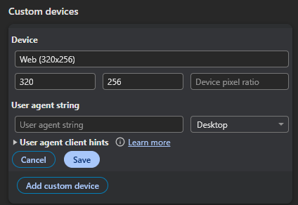
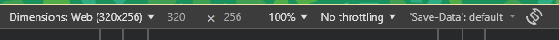
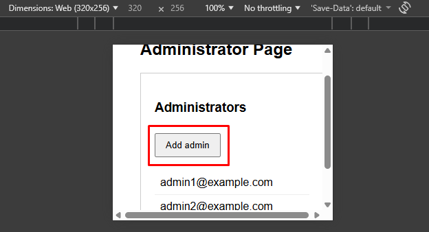
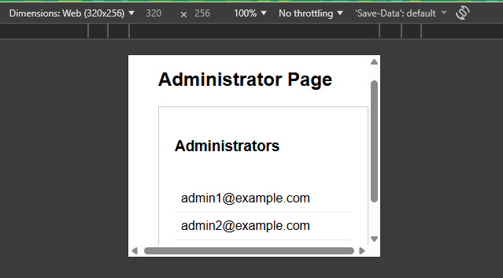

### [App Name][Accessibility][Stage][Add Admin]: Add admin button is not visible on 320x256 screen size.

**Pre-condition:**  
User has access to the application and is in the administrators page.  
Screen size is set to 320x256 (from developer tools simulator).  

**Steps to reproduce:**
1. Go to the administrators page.
2. Set the screen size to 320x256 using developer tools simulator.
3. Observe the visibility of the "Add admin" button.

**Expected Result:**  
The "Add admin" button is visible.  

**Actual Result:**  
The "Add admin" button is **not** visible.  

**Analysis:**  
Found during accessibility testing for Sprint 123.

**Location of Element:**  
[Provide the specific link where the bug occured]
